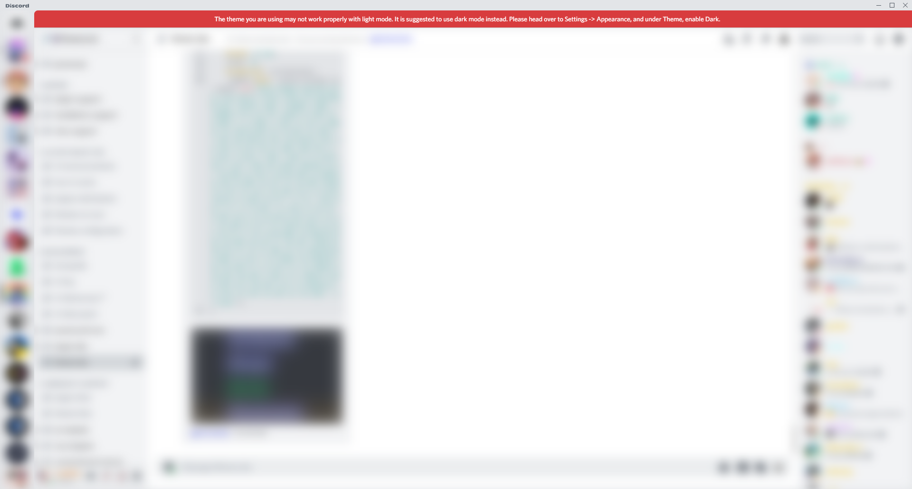
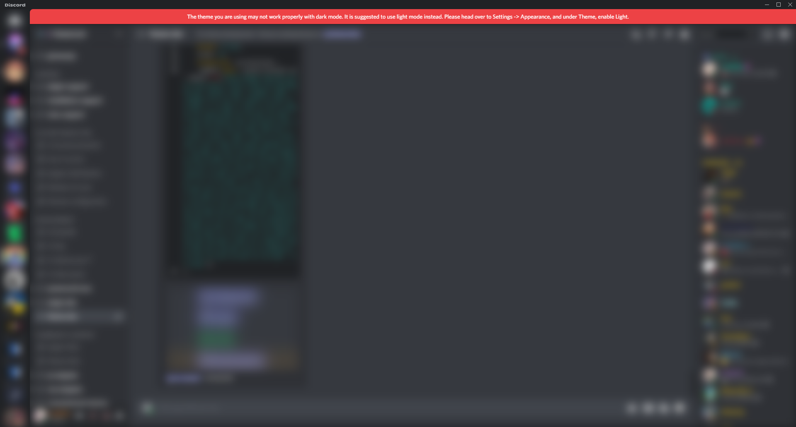
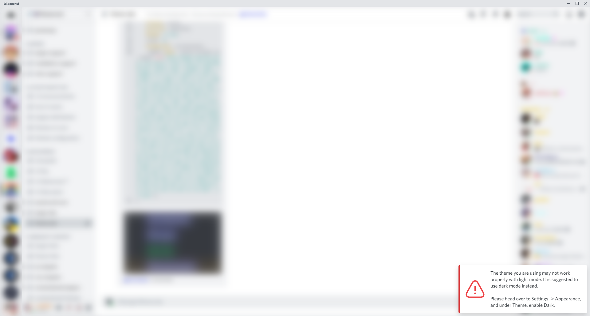
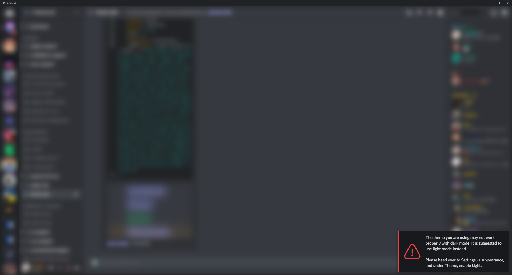

# The Purpose
This repo includes CSS & SCSS styling addons that you can apply to your theme which warn the user to switch theme modes if they are in the incorrect one. These are useful for themes that are specifically meant for either light or dark mode, or if your theme currently does not support both light and dark mode.

# Styles
You can find two folders in `./enable-dark` and `./enable-light` that include both CSS & SCSS styling. `enable-dark` is to warn the user to switch to dark mode and `enable-light` is to warn the user to switch to light mode.

If your theme is not a simple reskin of Discord, or you are not using any of Discord's variables, it is suggested to edit the styling to be consistent with your theme.

More styles may be added in the future. If you'd like the contribute a style, or suggest one, feel free to make an issue or pull request.

## Notice
Shows a notice banner that is native to Discord's notice banners.

## Notification
Shows a notification at the bottom right. If you want this notice to show in a different location, you have to change the positioning values.

# Contributors
||
|:-:|
|[Snapperito](https://github.com/Snapperito) - Original Idea|