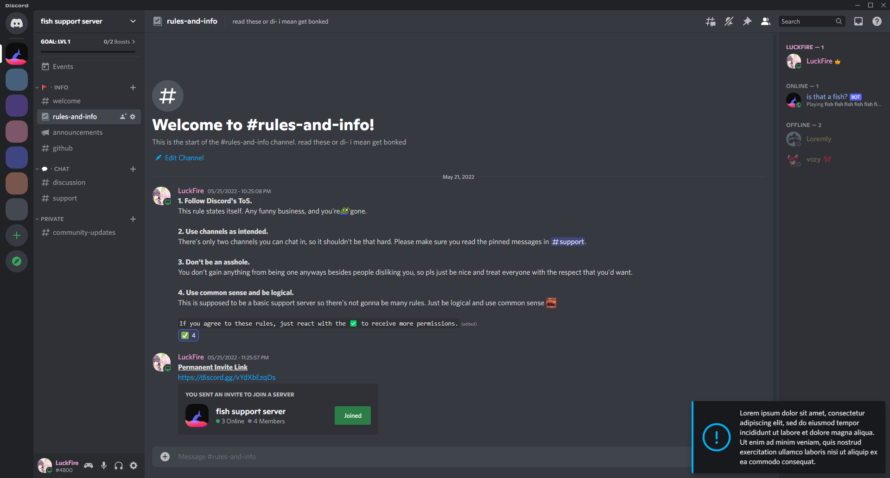
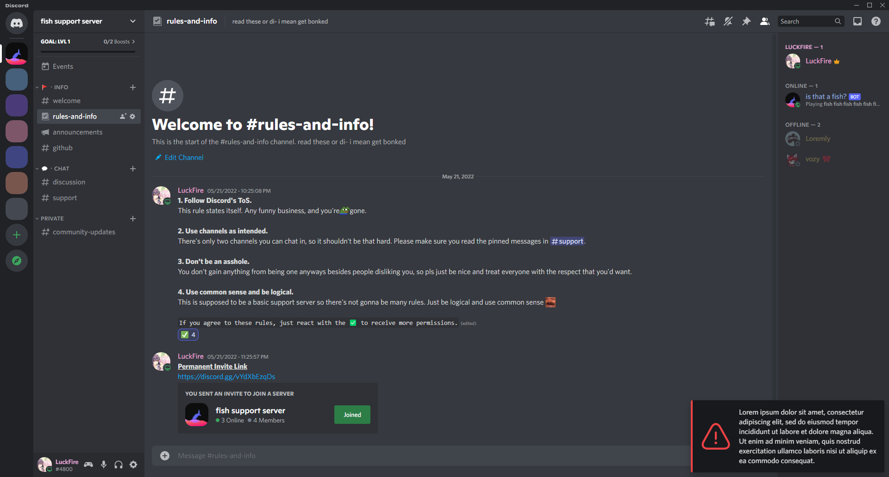

# The Purpose
This repo includes CSS & SCSS styles that you can use to add notices to your theme. These can be useful in some situations, such as showing a notice if the user is using an unsupported theme mode, or notifying the user of something else important.

It should be noted that these are not dismissable since they are made purely from CSS. You really should not use these unless you have a real good reason to.

# Styles
You can find both CSS & SCSS styling in the folders. It is suggested that you look through the styling and change it to your liking.

More styles may be added in the future. If you have a suggestion, feel free to make an issue on this repo or join my [support server](https://discord.gg/vYdXbEzqDs) and suggest them there.

## Banner
Shows a notice banner that is native to Discord's notice banners.

## Notification
Shows a notification at the bottom right. If you want this notice to show in a different location, you have to change the positioning values. There are two separate style types: information and warning.

### Information

### Warning

# Contributors
||
|:-:|
|[Snapperito](https://github.com/Snapperito) - Original Idea|

# Support Server
If you've ran into any issues, feel free to join the [support server](https://discord.gg/vYdXbEzqDs), or make an issue on this repository.