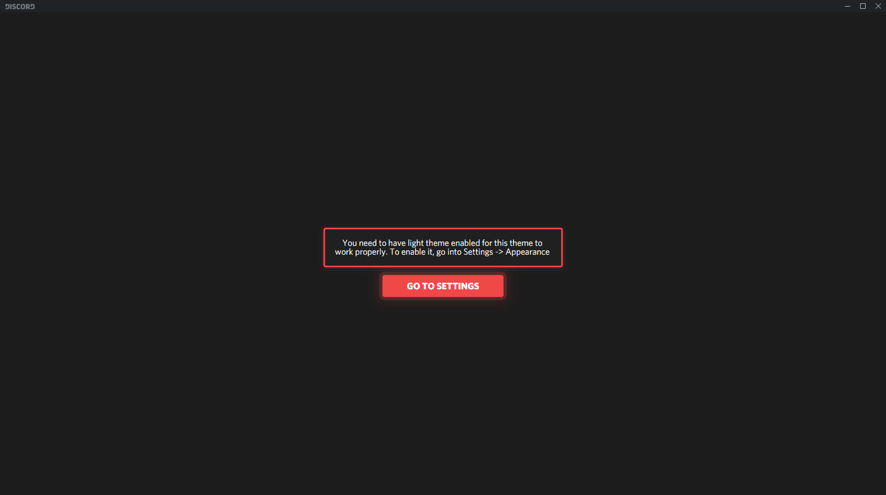
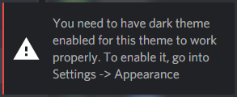
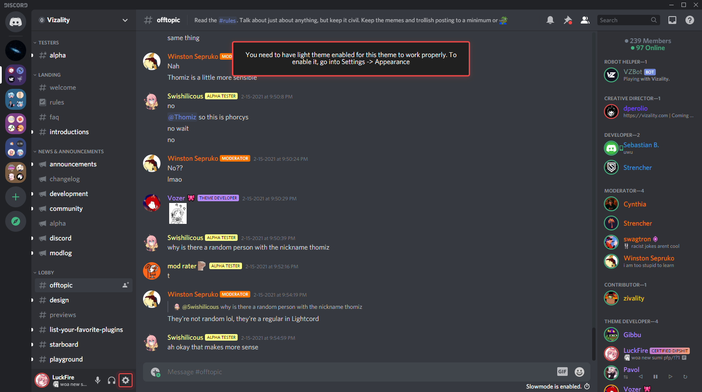

# Theme Warnings
A theme add-on that warns users for being in light/dark mode when they're not supposed to be.

# What's this for?
It's as the description says; it warns users for being in the wrong mode depending on what mode your theme is made for. If you're theme is cross compatiable with light and dark mode, this snippet will be useless for you. 

If your theme doesn't use Discord's native variables, you will have to customize the background color manually. Some exmaples of Discord's native variables are:
- --background-primary
- --background-tertiary

# Style Previews
Below are some previews on how the different styles of warnings look.
### Fullscreen

### Notification

### Unobstructive
