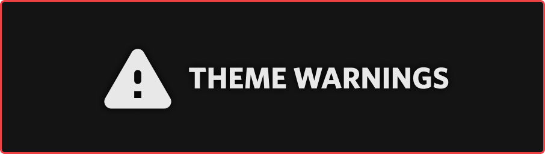
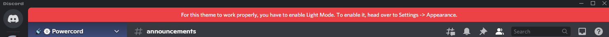
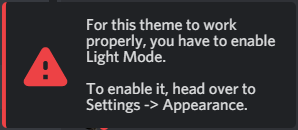
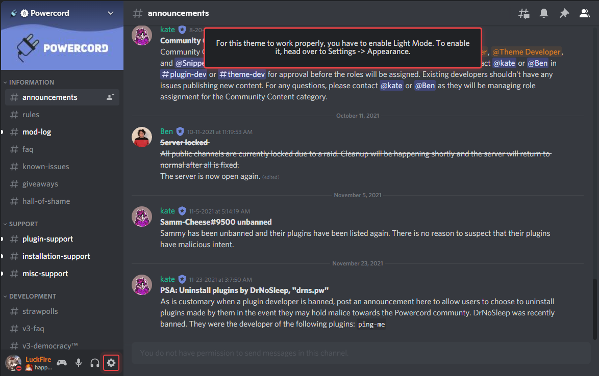

# Theme Warnings
A simple CSS addon for your theme that tells the user they're in the wrong theme mode.

# What's This For?
This repo include simple CSS / SCSS (in some scenarios) that you can implement into your themes that displays a warning to the user if they're in the wrong theme mode. This is useful for themes that only work with one theme mode.

If you plan on using these, please make sure you change the values as needed (i.e. text color, background color), as they use Discord's default colors.

## Styles
There are (currently) 3 different styles, which descriptions and previews of them can be found below.

### **Banner**
A warning style that replicates Discord's banner notifications (i.e. ones that show when you get a gift in your nitro inventory).

### **Notification**
Shows a notification menu in the bottom right, you can adjust some values and get it to show in a different location if you'd like.

### **Unobstructive**
Shows a warning in the top-middle of the screen.

## Credits
- [Snapper](https://github.com/Snapperito) for the original idea and referencing some of their original code.